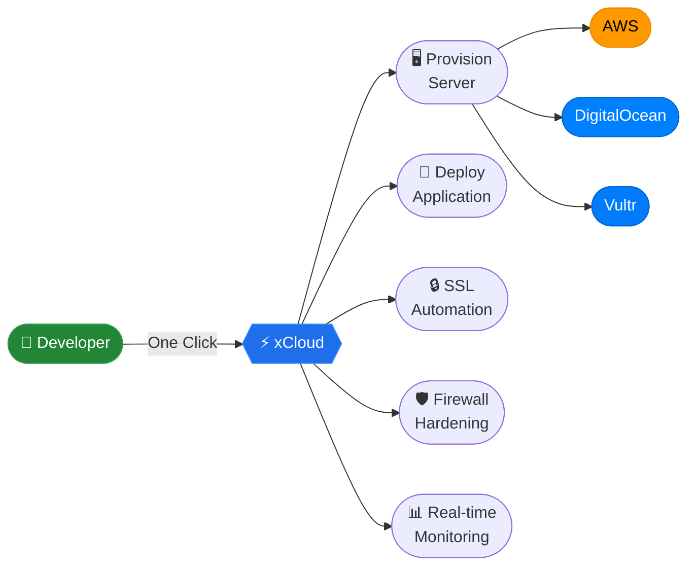

```bash
╭──────────────────────────────────────────────────────────────────────╮
│                                                                      │
│   █▀ ▄▀█ ▀█ ▀█ ▄▀█ █▀▄   █▀█ ▄▀█ █░█ █▀▄▀█ ▄▀█ █▄░█               │
│   ▄█ █▀█ █▄ █▄ █▀█ █▄▀   █▀▄ █▀█ █▀█ █░▀░█ █▀█ █░▀█               │
│                                                                      │
│   Full Stack Engineer  ·  Startise  ·  Dhaka, Bangladesh            │
╰──────────────────────────────────────────────────────────────────────╯

$ whoami
  Engineering the infrastructure layer —
  so developers never have to think about it.

$ cat links.txt
  🌐  sazzad.online
  💼  linkedin.com/in/sazzadur-rahmaan
  📘  facebook.com/sazzadurrahmannawshad
```

---

### `$ cat xcloud.md`

**xCloud** — cloud hosting & server management for everyone.  
One click. Any provider. Production-ready in minutes.



I work on both sides — the Laravel APIs powering the dashboard and the shell scripts running directly on the server. The goal is always to make complexity invisible to the person on the other side.

---

### `$ ls -la skills/`

```
drwxr-xr-x  backend/
  ├── PHP 8.4       Laravel       MySQL         Redis
  └── REST APIs     Sanctum       Horizon       Queue Systems

drwxr-xr-x  frontend/
  ├── Vue 3         Inertia.js    JavaScript
  └── Tailwind CSS  Alpine.js     SPA Architecture

drwxr-xr-x  infrastructure/
  ├── Linux         Nginx         Docker        Shell Scripting
  └── GitHub Actions  Cloudflare  VPS Setup     Security Hardening

drwxr-xr-x  cloud/
  └── AWS           DigitalOcean  Vultr
```

---

### `$ cat competencies.md`

| Domain | What I actually do |
|---|---|
| **System Design** | Scalable monoliths · API-first architecture · Queue-driven systems |
| **Server Automation** | VPS provisioning · SSL automation · 7G/8G firewall hardening |
| **Full Stack** | Laravel backend · Vue 3 frontend · Inertia.js SPA |
| **Cloud Operations** | Multi-provider infra · CI/CD pipelines · Deployment automation |
| **Database** | MySQL · Redis · Query optimization · Caching strategies |
| **Security** | Server hardening · Access control · SSL · Firewall config |

---

### `$ tail -f now.log`

```log
[✓] SHIPPED   Multi-provider provisioning — AWS · DigitalOcean · Vultr
[✓] SHIPPED   One-click SSL automation & site deployments
[✓] SHIPPED   7G/8G firewall hardening & team access control
[~] BUILDING  Git-based deployment pipeline
[~] BUILDING  Advanced monitoring & alerting system
[ ] QUEUED    Real-time server performance dashboard
```

---

### `$ git log --graph --oneline`


---

```bash
$ echo $PHILOSOPHY
  "The best infrastructure is the kind nobody notices."

$ █
```
