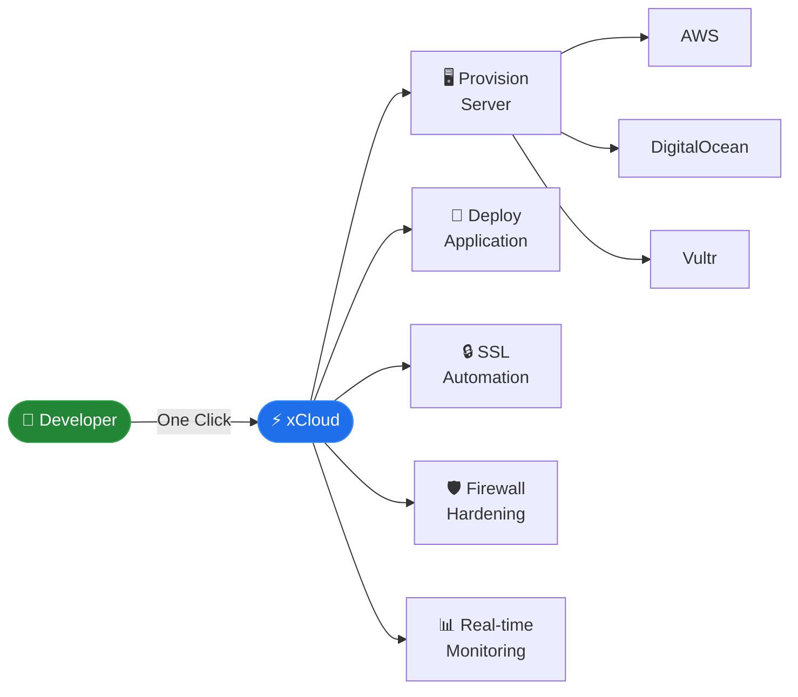

# Sazzadur Rahman

Full Stack Engineer at **Startise** &nbsp;·&nbsp; Dhaka, Bangladesh &nbsp;·&nbsp; [sazzad.online](https://sazzad.online)

---

### What I build

**xCloud** — a cloud hosting platform where provisioning a production server takes one click, not a weekend.

I work on both sides: the Laravel APIs powering the dashboard and the shell scripts running directly on the server. The goal is always the same — make complexity disappear for the person on the other side.

---

### How I work

> [!NOTE]
> I start with the problem, not the solution. I'd rather spend an hour thinking clearly than a day writing code in the wrong direction. I automate anything I do more than twice. Production is the only real measure of whether something works.

---

### The stack I trust

<kbd>PHP 8.4</kbd> &nbsp; <kbd>Laravel</kbd> &nbsp; <kbd>Vue 3</kbd> &nbsp; <kbd>Inertia.js</kbd> &nbsp; <kbd>MySQL</kbd> &nbsp; <kbd>Redis</kbd> &nbsp; <kbd>Tailwind CSS</kbd> &nbsp; <kbd>Linux</kbd> &nbsp; <kbd>Nginx</kbd> &nbsp; <kbd>Docker</kbd> &nbsp; <kbd>Shell</kbd> &nbsp; <kbd>Cloudflare</kbd>

---

### Now

- [x] Shipping xCloud to production teams
- [x] Multi-provider provisioning across AWS, DigitalOcean & Vultr
- [ ] Git-based deployment pipeline
- [ ] Advanced monitoring & alerting system

---

---

[LinkedIn](https://www.linkedin.com/in/sazzadur-rahmaan/) &nbsp;·&nbsp; [Website](https://sazzad.online) &nbsp;·&nbsp; [Facebook](https://www.facebook.com/sazzadurrahmannawshad)
